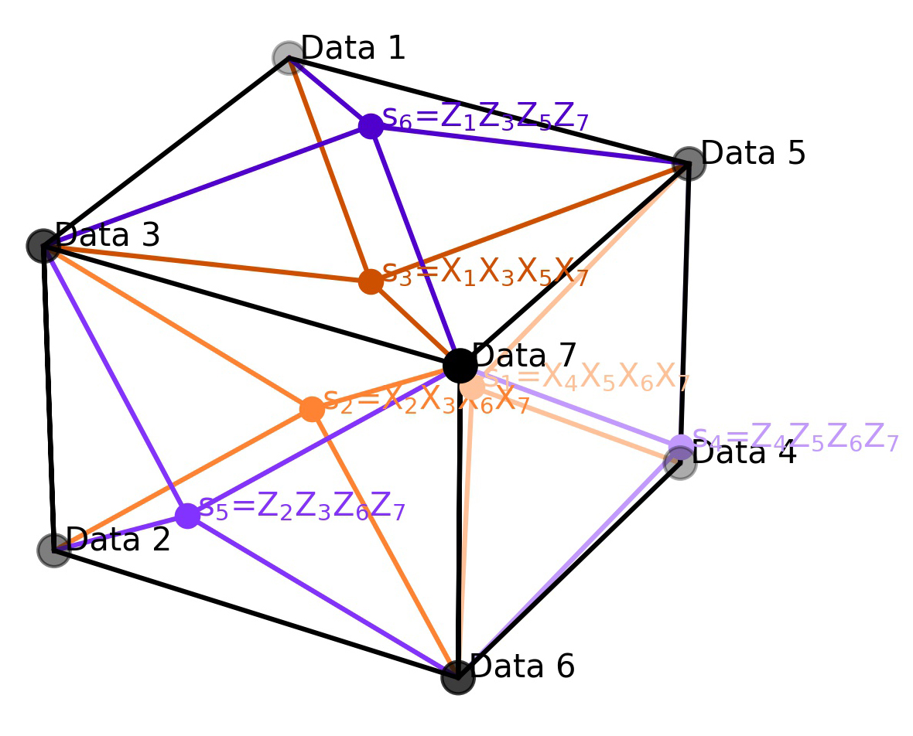

 
Overview
========

Quantum computers can carry out certain calculations quicker than classical computers.  However, error rates in quantum computers 
are high, and a range of techniques including quantum error correcting codes (QECCs) are needed to mitigate errors.  
The aim of much current research is to design, simulate, and implement QECCs that can operate fault tolerantly.  

The seven qubit Steane code is derived from the classical Hamming code and corrects both bit flip and phase flip errors, 
unlike the repetition code, which only corrects bit flip errors.  One logical qubit is encoded as seven physical qubits. 

A diagram of the Steane code is shown below:

The module circuits.py generates circuits for the Steane code for up to two logical qubits and has methods that:  

1. Set up a logical zero  
2. Perform a logical Hadamard  
3. Peform a logical CX to entangle the two logical qubits  
4. Set up ancilla based on the parity matrix  
5. Correct single physical qubit errors  
6. "Uncompute" the set up  

The code is based on `Qiskit <https://qiskit.org/>`_. The class ``SteaneCodeLogicalQubit`` extends the standard Qiskit class ``QuantumCircuit`` and so 
inherits its methods.

The set up of the logical zero, the ancilla and the ancilla correction is 
based on a parity_check_matrix which needs to be input.

At present only 32 physical qubits are allowed on Qiskit because it needs too much computing power to handle more.   
Because of this the circuit to correct errors can only be built for one logical qubit

It is envisaged that the code will be called from Jupyter notebooks and examples are provided in this repository.
